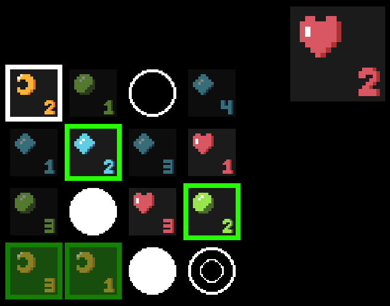

# Setto　・　セット

Setto is a matching game where two players compete to arrange four of their tokens in a line or square.

## Rules

On the first turn you can play your token on any space. On each subsequent turn you must place your token on a space matching either the symbol or number of the space previously chosen by your opponent.

The first player to arrange four of their tokens in a square or along a row, column, or diagonal wins!

## Features

- [x] optional hint system
- [ ] multiple levels of AI opponents
- [ ] options menu
- [ ] game replays
- [ ] player stats
- [ ] online play